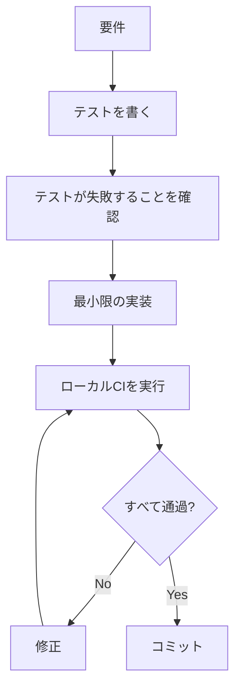

# GitHub Copilot Instructions

このファイルは、GitHub Copilotがこのプロジェクトで作業する際の指示を提供します。

**重要**: 詳細なガイドラインは `.claude/prompts/AGENT_MASTER_PROMPT.md` を参照してください。このファイルには、Claude と GitHub Copilot の両方に共通する包括的な開発方針が記載されています。

## クイックリファレンス

### 開発フロー

1. **TDD（テスト駆動開発）を実践**
   - テストを先に書く
   - 最小限のコードで実装
   - リファクタリング

2. **ローカルCIを実行**
   ```bash
   make ci-local
   ```

3. **コミット前のチェックリスト**
   - [ ] テストが通る
   - [ ] 型ヒントがある
   - [ ] Docstringが記述されている
   - [ ] リンターチェックが通る
   - [ ] ローカルCIが通る

4. **Pull Request作成（重要！）**
   - **通常の `gh pr create` は使用しない**
   - 必ず `gh pr-strict` エイリアスを使用
   - または手動で以下を実行：
     ```bash
     ruff format . && ruff check --fix . && mypy . && act push -q && gh pr create
     ```
   - 詳細は `.claude/prompts/AGENT_MASTER_PROMPT.md` の「Pull Request作成フロー（厳格版）」を参照

### コード生成時のルール

- **型ヒント**: すべての関数に型ヒントを追加
- **Docstring**: NumPy または Google スタイルで記述
- **テスト**: 新機能には必ずテストを追加
- **エッジケース**: ゼロ、無限大、NaN、空配列などをテスト

### よく使うコマンド

```bash
# テスト実行
make test

# リンター
make lint

# フォーマット
make format

# 型チェック
make type-check

# ローカルCI（actを使用）
make ci-local

# すべてのチェック
make ci
```

### 依存関係の追加

```bash
echo "package-name>=version" >> requirements.in
make compile
make install
```

## 詳細ドキュメント

- **マスタープロンプト**: `.claude/prompts/AGENT_MASTER_PROMPT.md`
- **ローカルテスト**: `LOCAL_TESTING.md`
- **プロジェクト構造**: `ARCHITECTURE.md`
- **貢献ガイド**: `CONTRIBUTING.md`

## プロジェクト固有の注意事項

### 研究ソフトウェア開発

このプロジェクトは研究用途を想定しているため、以下の点に特に注意してください：

- **再現性**: すべての依存関係を固定バージョンで管理
- **数値精度**: 浮動小数点演算の精度問題を考慮
- **ランダムシード**: 確率的プロセスには必ずシードを設定
- **ドキュメント**: アルゴリズムの出典や計算複雑性を記載

### ワークフロー



## 禁止事項

- **テストなしでの実装**: 必ずテストを先に書く
- **型ヒントの省略**: すべての関数に型ヒントが必要
- **過度な抽象化**: 必要最小限のコードを書く
- **未使用コードの保持**: 不要なコードは削除する

## リソース

- [act公式ドキュメント](https://github.com/nektos/act)
- [pytest公式ドキュメント](https://docs.pytest.org/)
- [ruff公式ドキュメント](https://docs.astral.sh/ruff/)
- [mypy公式ドキュメント](https://mypy.readthedocs.io/)
